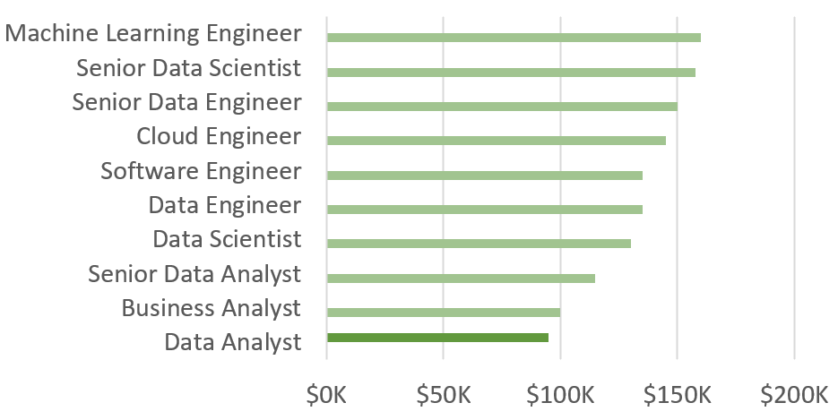
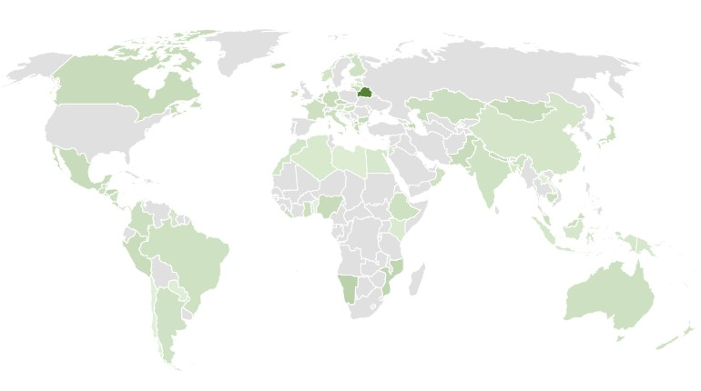
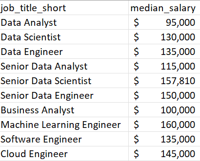
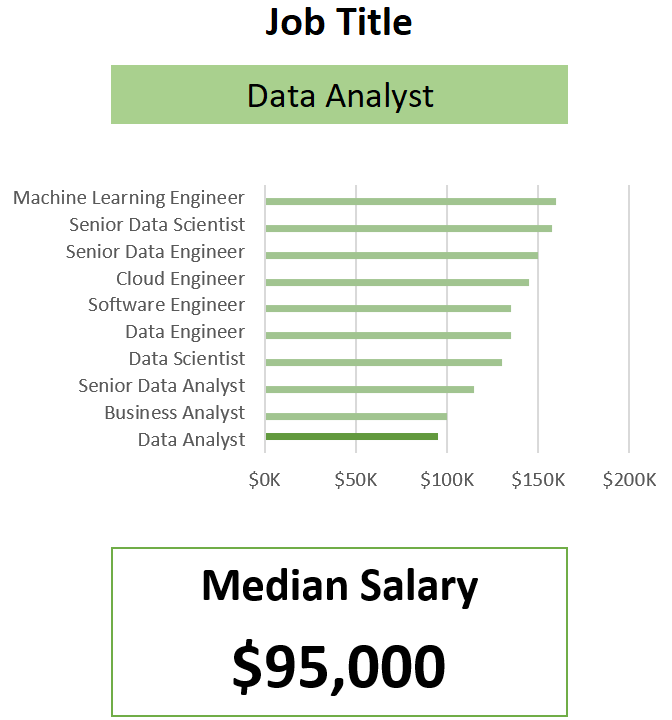
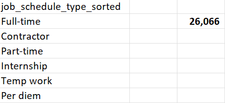
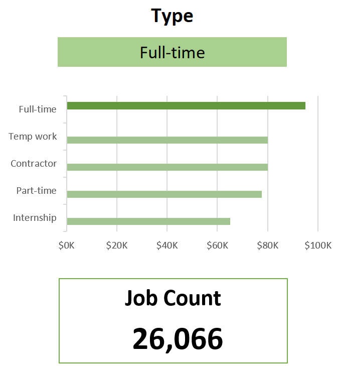

# Data Nerds Salary Dashboard — Excel

The [salary_dashboard.xlsx](salary_dashboard.xlsx) helps job seekers explore salary trends across data-related job titles and understand how compensation shifts by **role**, **country**, and **schedule type**. It highlights salary differences across positions and locations, making it easier to benchmark target roles and set realistic salary expectations.

For dataset scope, shared definitions, and course resources, see the [main README](../../README.md).


---

## Tools & skills demonstrated

- **Excel charts**
  - Horizontal bar chart for role-level salary comparison
  - Country map chart for geographic salary context
  - Schedule-type salary comparison chart
- **Formulas and functions**
  - Multi-criteria median calculation
  - Filtered lists for clean, consistent inputs
- **Data validation**
  - Dropdown selectors for Job Title, Country, and Type

---

## The analysis

### 1. Job title salary comparison (bar chart)



- Job titles are sorted by salary to improve scanability and highlight salary tiers.
- The chart makes it easy to compare the selected role against adjacent roles (same country/type slice).

### 2. Geographic salary context (map chart)



- The map provides quick country-level context for salary benchmarking.
- It helps interpret why the same role can have different typical pay depending on location.

---

### 3. Median salary by job title (multi-criteria formula)

```excel
=MEDIAN(
IF(
    (jobs[job_title_short]=A2)*
    (jobs[job_country]=country)*
    (ISNUMBER(SEARCH(type,jobs[job_schedule_type])))* 
    (jobs[salary_year_avg]<>0),
    jobs[salary_year_avg]
)
)
```

- Filters by job title, country, and schedule type
- Excludes missing/zero salaries
- Populates the background table used by the dashboard visuals

Background table:



Dashboard implementation:



---

### 4. Clean schedule-type list (for dropdown validation)

```excel
=FILTER(J2#,(NOT(ISNUMBER(SEARCH("and",J2#))+ISNUMBER(SEARCH(",",J2#))))*(J2#<>0))
```
- Removes combined/compound labels (containing “and” or commas)
- Produces a clean list used for validated dropdown inputs

Background table:



Dashboard implementation:



---

### 5. Data validation (validated dropdown inputs)

- Validated dropdowns for **Job Title**, **Country**, and **Type** ensure consistent input values.
- This reduces user errors and keeps dashboard outputs stable and comparable.

## Conclusion

This dashboard demonstrates practical Excel reporting: multi-criteria salary metrics, chart-driven comparisons, and validated inputs for interactive exploration of salaries by role, country, and schedule type.