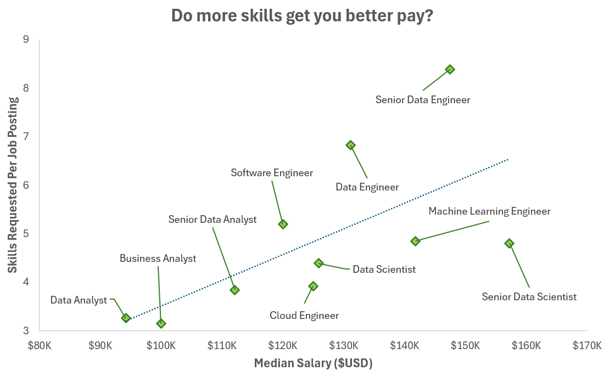
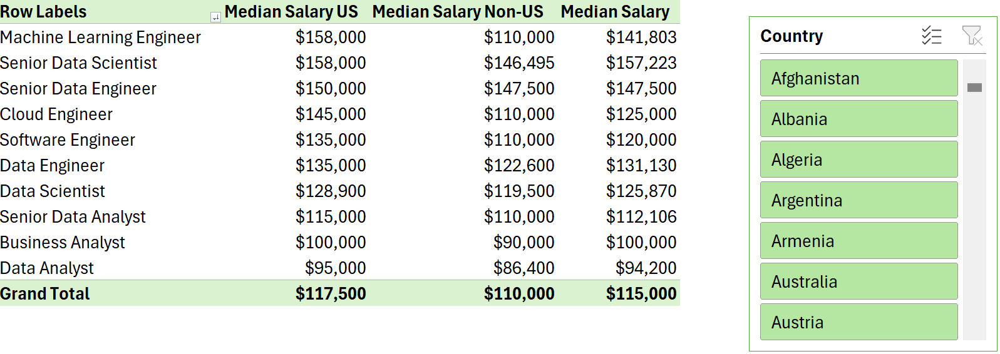
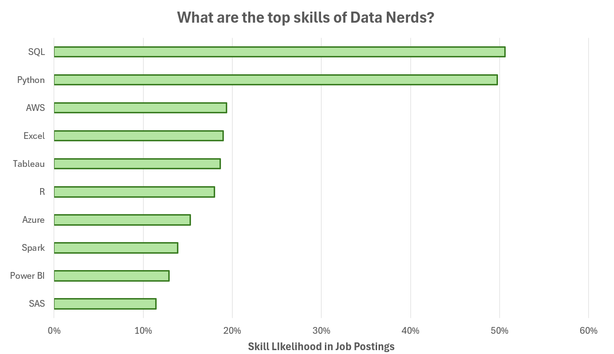
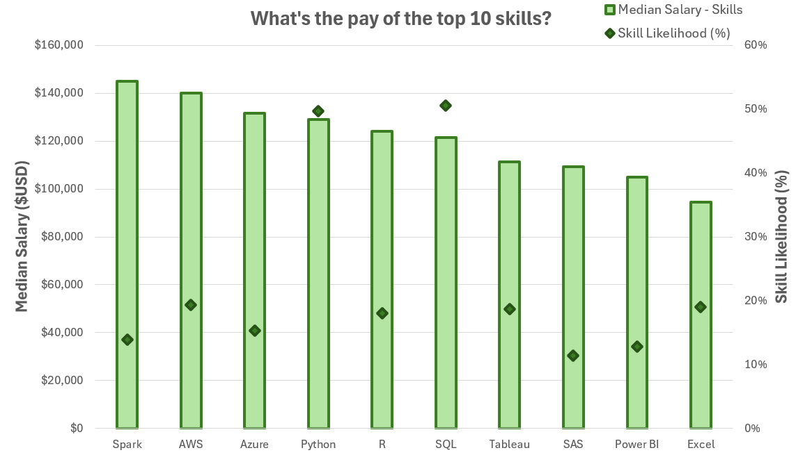
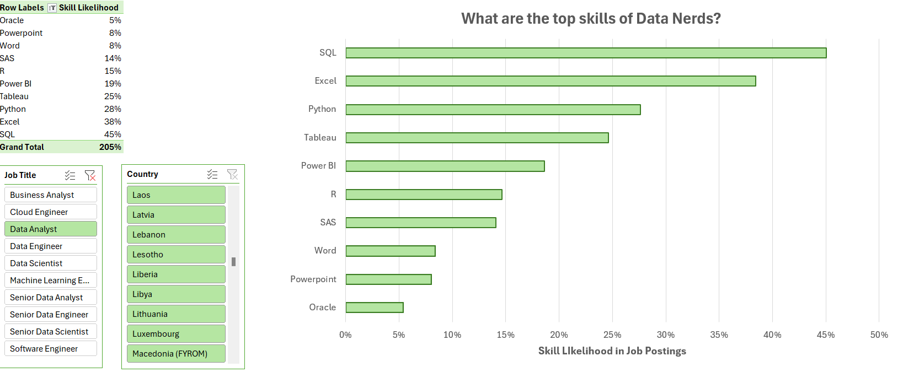
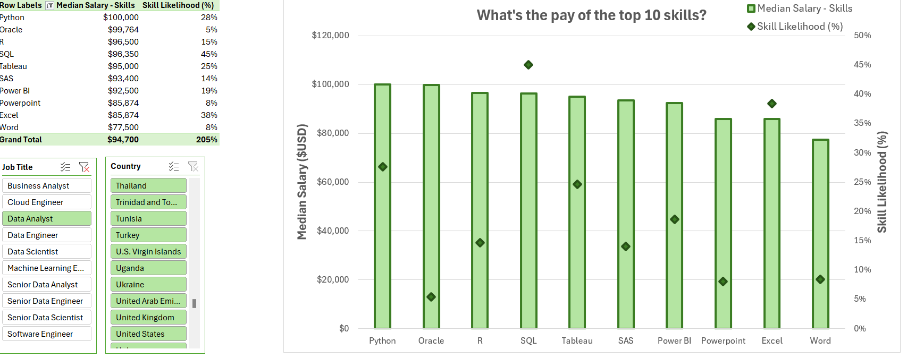

# Data Nerds Skill Analysis — Excel

This [Data Nerds Skill Analysis](skill_analysis.xlsx) highlights which skills employers request most often across data roles and how those skills relate to pay signals. It connects **skill likelihood** with **median salary** to support more evidence-based skill prioritization.

For dataset scope, shared definitions, and course resources, see the [main README](../../README.md).

## The questions

1. Do more skills correlate with better pay?
2. What’s the salary for data jobs in different regions?
3. What are the top skills of data professionals?
4. What’s the pay signal of the top skills (median salary + likelihood)?

---

## Tools & skills demonstrated

- **Power Query (ETL)**
  - Import, cleaning, type setting, and text standardization
  - Building a skills table (one row per skill per posting)
- **Power Pivot**
  - Relational data model (jobs ↔ skills via `job_id`)
- **DAX**
  - Measures for median salary and region-specific filtering
- **PivotTables & PivotCharts**
  - Role-level and skill-level aggregation
  - Combo chart: salary + likelihood in one view

---

## The analysis

### 1. Do more skills correlate with better pay? (Power Query workflow — ETL)

#### Extract:

I used Power Query to import the source dataset (`data_jobs_salary_all.xlsx`) and create two queries:
- `data_jobs_all` (job-level information)
- `data_job_skills` (skills listed per job ID)

#### Transform

Both queries were standardized by changing data types, removing unnecessary columns, and cleaning key text fields (including trimming whitespace).


#### Load

Finally, both transformed queries were loaded into the workbook to support modeling and analysis.


#### Results



#### Insights

- There is a positive relationship between the number of skills requested in postings and median salary, especially for senior and engineering-heavy roles.
- Roles associated with fewer listed skills tend to cluster lower on the salary axis, suggesting that broader/specialized requirements often coincide with higher pay in this dataset.

---

### 2. What’s the salary for data jobs in different regions? (PivotTables + DAX measures)

I created a PivotTable using the Data Model, placing:
- `job_title_short` in rows
- `salary_year_avg` as the salary metric

Then I added measures to compare overall median salary with a US-only median salary.

```excel
US Median Salary :=
CALCULATE(
    MEDIAN(data_jobs_all[salary_year_avg]),
    data_jobs_all[job_country] = "United States"
)
```

```excel
Median Salary := MEDIAN(data_jobs_all[salary_year_avg])
```

#### Results



#### Insights

- Higher-paying roles remain higher-paying across regions, with a visible gap between US and non-US medians for several roles.
- Regional comparisons provide context for interpreting role-level compensation differences more realistically.

---

### 3. What are the top skills of data professionals? (Power Pivot data model)

I created a data model by integrating `data_jobs_all` and `data_job_skills` and defining a relationship using `job_id`.


#### Results



#### Insights

- SQL and Python appear as foundational skills across data roles.
- Cloud tools (e.g., AWS, Azure) show up frequently, reflecting broad adoption of cloud-based stacks.

---

### 4. What’s the pay signal of the top skills? (Pivot chart — median salary + likelihood)

I built a combo chart to visualize both:
- **Median salary** (clustered columns)
- **Skill likelihood (%)** (markers)

I then removed the likelihood line to reduce clutter and kept markers to preserve the demand signal.

#### Results



#### Insights

- Demand and pay signal are not the same: common skills maximize job access, while some less common skills can show stronger salary signals.
- Viewing salary and likelihood together produces a more practical skill prioritization than either metric alone.

---

## Example slice: Data Analyst

### A. Top skills (likelihood) for Data Analyst



Interpretation:
- The profile is strongly **reporting/BI-oriented**: Excel + Tableau/Power BI signal day-to-day work centered on dashboards, stakeholder reporting, and ad-hoc analysis.
- **SQL is the dominant baseline**, which matches the reality that analysts spend a lot of time extracting and shaping data before it ever hits a dashboard.
- **Python shows up as a “second-layer” skill**: common enough to matter, but typically used for automation, deeper analysis, or working with messy/large datasets rather than being the primary requirement in every posting.
- Compared with more technical roles in the broader data market, this skill mix leans away from infrastructure/cloud tooling and toward **analysis + communication tooling** (BI + spreadsheets).

### B. Pay signal (median salary + likelihood) for Data Analyst



Interpretation:
- **SQL + Excel = highest job access**: they sit on the high-likelihood end, so they are the strongest “entry + employability” skills across postings.
- **Python = potential pay uplift**: while it appears less often than SQL/Excel, it tends to be associated with a higher median salary, which can indicate analyst roles that are more technical (automation, analytics engineering tasks, experimentation support).
- **BI tools (Tableau/Power BI) are strong differentiators but not always a salary accelerator**: they often function as “expected” tooling in analyst hiring, while the biggest pay separation typically comes from adding more technical capability (Python, heavier SQL, data modeling).
- A practical way to read this chart is as a **skill ladder**:  
  **(1) SQL + Excel** to maximize job access → **(2) Tableau/Power BI** to match reporting expectations → **(3) Python** to move into higher-paying analyst segments.
- Context vs the broader market: Data Analyst medians tend to sit below more technical data roles (e.g., DE/DS). Skills that push an analyst toward more engineering/automation responsibilities are the ones most likely to narrow that gap.

---

## Conclusion

This project demonstrates Excel analytics beyond spreadsheets: Power Query ETL, a relational Power Pivot model, DAX measures, and pivot-driven visuals that connect **skill demand** with **salary signals** in an interactive dashboard.