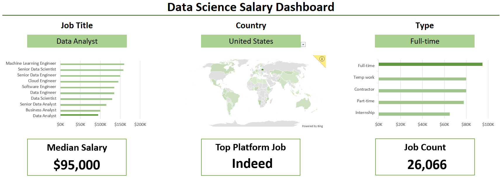

# Data Job Postings Dashboards (2023–2025) — Excel

This folder contains two Excel dashboards built on **real-world data job postings (2023–2025)**. The projects demonstrate progression from **formula-driven dashboarding** ([salary_dashboard.xlsx](01_salary_dashboard/salary_dashboard.xlsx)) to a more scalable approach using **Power Query + Power Pivot + DAX** ([skill_analysis.xlsx](02_skill_analysis/skill_analysis.xlsx)), with the goal of turning job market data into clear, actionable insights.

For dataset scope, shared definitions, and course resources, see the [main README](../README.md).

---

## Featured dashboards

### Data Nerds Salary Dashboard (Excel — Formulas + Data Validation)

An interactive salary exploration dashboard that helps job seekers compare compensation across data roles. It highlights how **median salary** and **job volume** shift by **job title**, **country**, and **schedule type**, making it easier to benchmark roles and make more informed career decisions.

[Salary dashboard documentation](01_salary_dashboard/README.md)

---

### Data Nerds Skill Analysis (Excel — Power Query + Power Pivot + DAX)

A skills-focused dashboard that surfaces which tools employers request most often across data roles. It shows how skill demand varies by role and region, and how different skills relate to compensation—linking **skill likelihood** with **salary signals** to help prioritize what to learn next.

[Skill analysis documentation](02_skill_analysis/README.md)

---

## Conclusion

These two dashboards show progression from **formula-driven Excel dashboarding** to a more scalable approach using **Power Query + Power Pivot + DAX**. Together they demonstrate practical Excel analytics skills relevant to reporting, modeling, and interactive insight delivery.