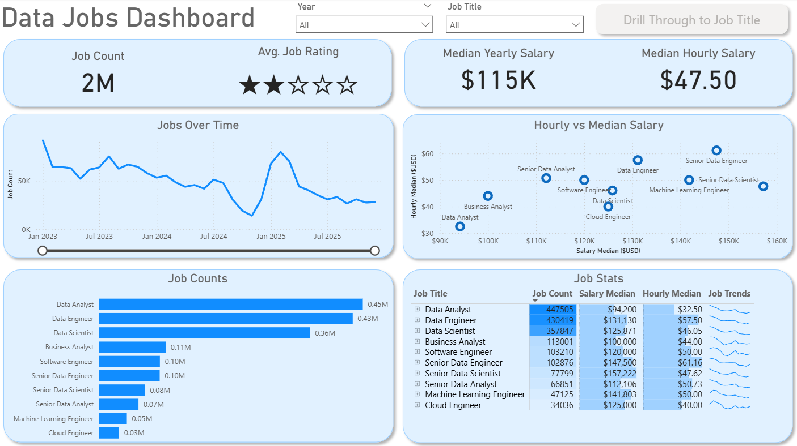
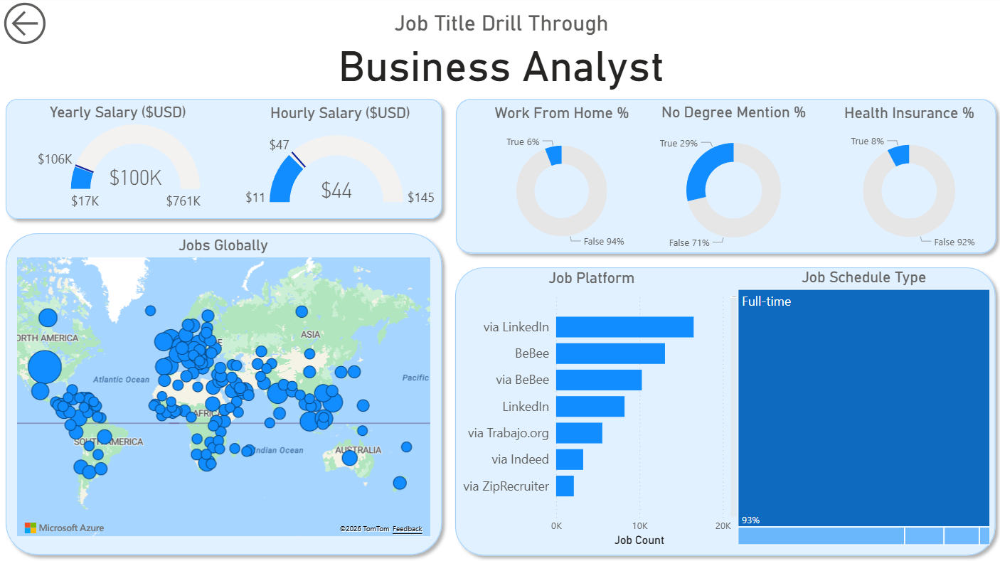

# Data Jobs Dashboard (V1) — Power BI

This dashboard was built for people exploring the **data job market**, including **job seekers** and professionals considering a **career transition**. Information about data roles is often fragmented across multiple sources, making it difficult to form a clear, **data-driven view** of salaries, demand, and job characteristics.

This report consolidates key insights into an **interactive, multi-page Power BI dashboard** that allows users to **explore trends** and **compare roles efficiently**.

For dataset scope, shared definitions, and course resources, see the [main README](../../README.md).

[**Interactive report (Power BI Service)**](https://app.powerbi.com/view?r=eyJrIjoiYTkwYmFiZTYtYWUyNS00MTc0LWE0OTQtZWM0ZjA2ZmEyOTdiIiwidCI6ImRmODY3OWNkLWE4MGUtNDVkOC05OWFjLWM4M2VkN2ZmOTVhMCJ9&pageName=b309e62db0dc628c8c6b)

---

## Tools & skills demonstrated

This project focuses on applying **core Power BI functionality** within a complete reporting workflow:

- **Working with prepared datasets:** Using an existing dataset of job postings and understanding its structure for analytical purposes.
- **Standard aggregations and built-in calculations:** Leveraging default Power BI aggregations to analyze metrics such as **job count** and **salary distributions**.
- **Core visualizations:** Using **column, bar, and line charts** to explore job demand and compensation trends.
- **Geospatial analysis:** Map visuals to display the **global distribution** of data-related roles.
- **KPIs and tabular views:** Cards for **headline metrics** and tables for **detailed, sortable breakdowns**.
- **Report layout and visual design:** Structuring a **multi-page dashboard** to balance high-level overview with detailed analysis.
- **Interactive reporting features:**
  - **Slicers** for filtering by job title
  - **Buttons and bookmarks** for report navigation
  - **Drill-through** functionality for role-level analysis

---

## Report structure

The report is organized into **two pages**, combining overview-level insights with focused analysis.

### Page 1: Market Overview

This page provides a **high-level snapshot** of the data job market. It highlights key KPIs such as **total job postings**, **median salaries**, and the **most common job titles**, allowing users to quickly assess overall market conditions.

### Page 2: Job Title Drill Through

This page enables **deeper analysis** for a selected job title. Users can drill through from the main dashboard to explore **salary distributions**, **remote work prevalence**, **leading job platforms**, and **geographic concentration** for a specific role.

---

## Example drill-through: Business Analyst (sample insights)

This section is a short example of what the drill-through page enables for any selected job title.

- **Scale:** **113K** postings for Business Analyst → high-volume role with broad coverage, so patterns are less likely to be driven by a small niche sample.
- **Pay level:** **Median yearly salary = $100K**, **median hourly salary = $44** → solid “typical” pay, but Business Analyst compensation is generally lower than more technical data roles (e.g., Data Engineer / Data Scientist), which often carry a stronger engineering/ML premium.
- **Wide pay dispersion:** yearly ranges roughly from **$17K to $761K**, hourly from **$11 to $145** → indicates mixed posting types and strong outliers; median is the most reliable summary.
- **Remote signal is rare:** only **6%** marked `job_work_from_home=True` → **below the dataset baseline** (~**8.8%**), suggesting BA roles skew more on-site/hybrid *in this dataset* than the average data posting.
- **No-degree mention:** **29%** show `job_no_degree_mention=True` → slightly **below the dataset baseline** (~**33.4%**), implying fewer explicit “no-degree” signals vs the overall market snapshot.
- **Benefits mention:** only **8%** mention health insurance → **below the dataset baseline** (~**11.5%**), so BA postings appear less likely to surface benefits explicitly.
- **Schedule type:** **Full-time (~93%)** → **above the dataset baseline** (~**87%**), meaning BA demand here is even more full-time dominated than the overall data-job mix.
- **Posting sources (top):** **LinkedIn** and **BeBee** appear most often → platform mix can affect what gets stated (salary/benefits/remote), so it’s useful context when comparing roles.

---

## Conclusion

This project shows how Power BI can turn job posting data into an **interactive exploration tool**. Through **filtering**, **slicing**, and **drill-through interactions**, users can analyze the data job market from multiple perspectives and derive practical role-level insights.