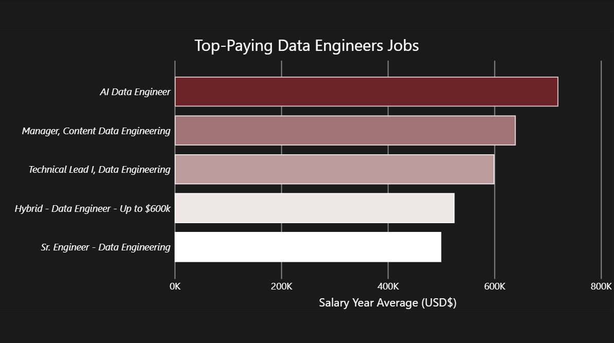
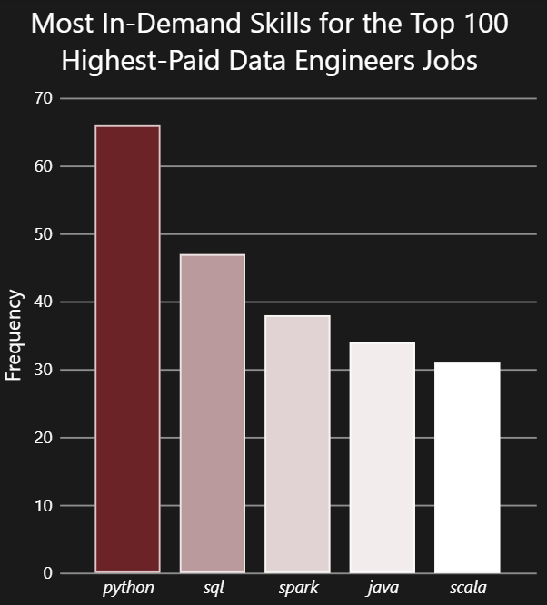
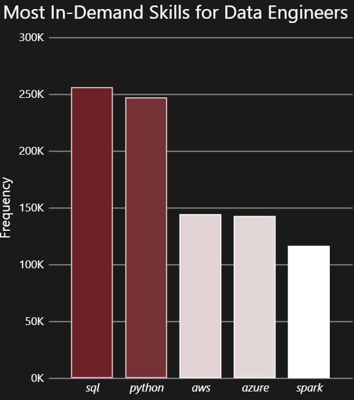
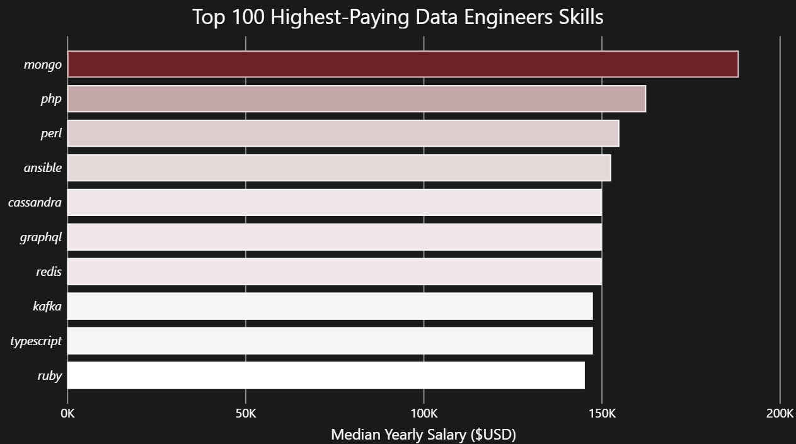
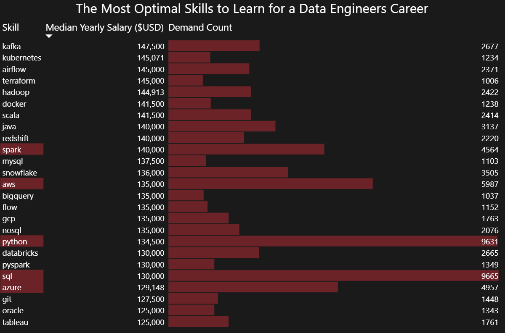
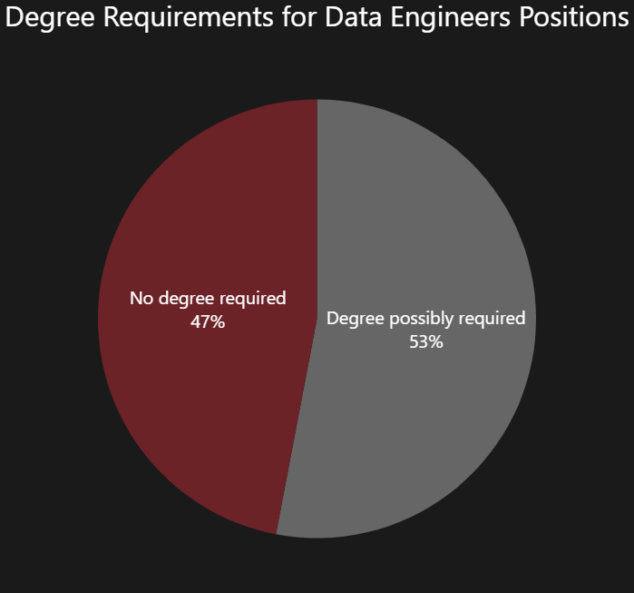
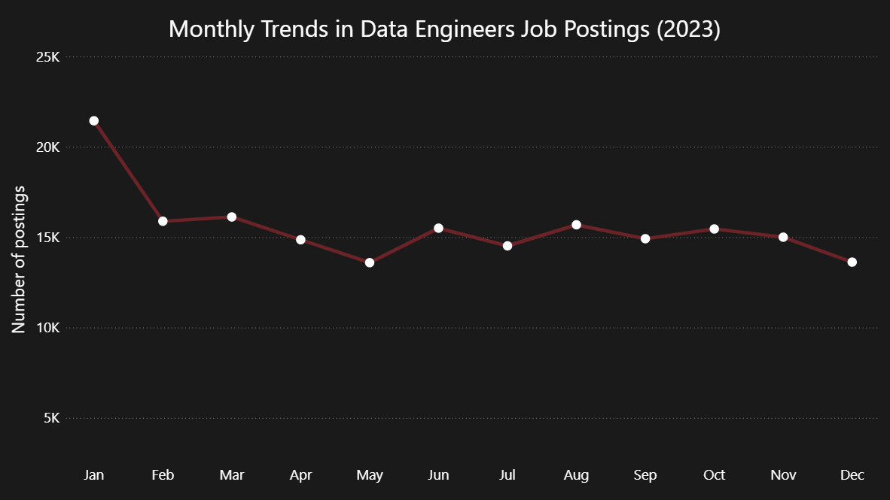
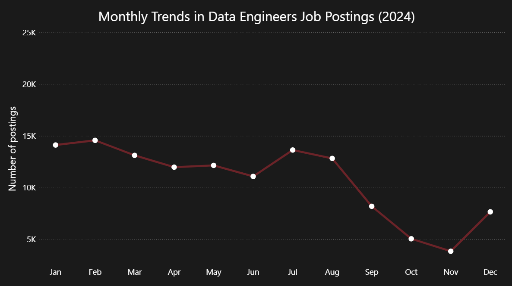

# Data Engineer Job Market Analysis (2023–2025) — SQL + Power BI

This project analyzes **real-world data job postings** with a focus on **Data Engineer** roles. The goal is to identify what employers ask for most often (skills), where compensation signals are strongest, and which skills sit at the best intersection of **pay + opportunity**.

For dataset scope, shared definitions, and course resources, see the [main README](../README.md).

---

## Questions

This project answers the following questions:

1. What are the top-paying Data Engineer job postings? [01_top_paying_jobs.sql](sql_queries/01_top_paying_jobs.sql)
2. Which skills appear most often in the top 100 highest-paid Data Engineer postings? [02_top_paying_jobs_skills.sql](sql_queries/02_top_paying_jobs_skills.sql)
3. What are the most in-demand skills for Data Engineers overall? [03_top_demanded_skills.sql](sql_queries/03_top_demanded_skills.sql)
4. Which skills are associated with the highest median salaries (with a minimum sample size)? [04_top_paying_skills.sql](sql_queries/04_top_paying_skills.sql)
5. What are the most optimal skills to learn (high demand and strong pay signal)? [05_optimal_skills.sql](sql_queries/05_optimal_skills.sql)
6. How often do postings mention degree requirements vs not? [06_degree_requirements.sql](sql_queries/06_degree_requirements.sql)
7. How does Data Engineer posting volume change month-to-month across 2023–2025? [07_monthly_job_postings.sql](sql_queries/07_monthly_job_postings.sql)

---

## Tools & skills demonstrated

- **SQL (PostgreSQL)**
  - Joins across a relational schema (fact + dimension tables)
  - Aggregations (`COUNT`, median via `percentile_cont(0.5)`), filtering, ordering, limits
  - CTEs (`WITH`) for reusable logic
  - Date functions (`EXTRACT`, `DATE_TRUNC`, formatting)
  - Building analysis-ready **views** for downstream BI
- **Power BI**
  - Connecting to SQL views as a semantic analysis layer
  - Visual storytelling: bar charts, tables, pie charts, time trends

---

## The Analysis

### 1. What are the top-paying Data Engineer job postings?

I filter Data Engineer postings to those with a reported `salary_year_avg`, sort descending, and take the top results to show the highest-compensation roles in the dataset.

[01_top_paying_jobs.sql](sql_queries/01_top_paying_jobs.sql)

#### Results

#### Insights

- The top salary is a clear outlier: **AI Data Engineer ($720k)** sits well above the rest of the top list (next roles are roughly in the **$500k–$650k** range).
- The “AI” label likely explains part of this gap — AI-focused data engineering often involves or overlaps with building scalable training/feature pipelines and platform-level infrastructure, which can command a pay premium.
- Several titles suggest seniority or leadership scope (Manager / Technical Lead), which likely explains why pay jumps are not linear across the chart.
- One entry includes an “Up to $600k” claim in the title, so treat this list as “highest values captured in the dataset,” not a guarantee of typical pay.

---

### 2. Which skills show up most often in the top 100 highest-paid postings?

I select the top 100 highest-paid Data Engineer postings (salary present), join to the skills tables, and count which skills appear most frequently in this top-paid subset.

[02_top_paying_jobs_skills.sql](sql_queries/02_top_paying_jobs_skills.sql)

#### Results

#### Insights

- In the top-paid subset, **Python** and **SQL** dominate — these are the baseline skills even at the high end.
- The next most common skills are **Spark**, **Java**, and **Scala** — a clear sign that many high-paid roles revolve around building large-scale, production data pipelines rather than analytics/reporting-only work.
- Compared to the overall market view, the top-paid segment is more engineering-heavy (Spark + Java/Scala are especially visible here).

---

### 3. What are the most in-demand skills for Data Engineers overall?

I count skill mentions across all Data Engineer postings (no salary filter), returning the top skills by frequency.

[03_top_demanded_skills.sql](sql_queries/03_top_demanded_skills.sql)

#### Results

#### Insights

- **SQL** slightly leads **Python** — query-first data work is the most consistent baseline across postings.
- **AWS** and **Azure** are almost tied, which suggests a fairly cloud-neutral market in this dataset (vendor choice varies by employer, but cloud competence is mainstream).
- **Spark** remains a core big-data tool, but it shows up less frequently than cloud skills — many DE roles likely operate on managed cloud stacks where Spark is common but not universal.

---

### 4. Which skills are associated with the highest median salaries?

I restrict to postings with salary present, compute median salary per skill using `percentile_cont(0.5)`, and apply a minimum sample size (`COUNT >= 100`) to reduce noisy results from rare skills.

[04_top_paying_skills.sql](sql_queries/04_top_paying_skills.sql)

#### Results

#### Insights

- This ranking shows the **median salary** for postings that mention a skill (with `COUNT >= 100`) — a pay signal, not a “best skills to start with” list.
- Median is **less sensitive to outliers** than average, so the ordering is more robust when a few extreme salaries exist in the dataset.
- Some skills can act as **proxies for role context** (e.g., enterprise/compliance stacks), which can lift the median pay signal.

---

### 5. What are the most optimal skills to learn (high demand + strong pay signal)?

To identify “optimal” skills, I compute two metrics for each skill within salary-reported postings:
- **Demand count** (how often the skill appears)
- **Median salary** (median `salary_year_avg` among postings that mention the skill)

I then filter to skills with a strong demand signal (`demand_count > 1000`) and rank primarily by median salary, then demand.

[05_optimal_skills.sql](sql_queries/05_optimal_skills.sql)

#### Results

#### Insights

- Baseline skills dominate opportunity: **SQL** and **Python** have the highest demand counts in this salary-reported subset, making them the strongest “job access” skills.
- Cloud is the next layer: **AWS** is more common than **Azure** here and shows a slightly stronger median pay signal in this dataset.
- High-pay uplift tends to come from “platform + infra” skills with solid demand: **Kafka**, **Scala**, **Airflow**, **Kubernetes**, **Terraform**.
- Tools that often indicate modern data stacks sit in a strong middle zone: **Spark** and **Snowflake** combine meaningful demand with strong median salaries.

---

### 6. How often do postings mention degree requirements?

I use `job_no_degree_mention` to estimate the share of postings that explicitly state a degree is not required versus those that do not state that (which is not the same as “degree required”).

[06_degree_requirements.sql](sql_queries/06_degree_requirements.sql)

#### Results

#### Insights

- Nearly half of postings **explicitly state no degree is required** (47%), which is a strong signal that entry via experience/skills-based hiring is realistic for many candidates.
- This field captures what is **explicitly mentioned** in the posting. “False” should be read as “not stated,” not as a guaranteed requirement.

---

### 7. How does posting volume change month-to-month (2023–2025)?

I count Data Engineer postings by month across the full dataset range and visualize the year-by-year monthly patterns.

[07_monthly_job_postings.sql](sql_queries/07_monthly_job_postings.sql)

#### Results

#### Insights

- Across all three years, the dataset shows a consistent pattern: **the highest posting volume appears early in the year**, then softens later.
- **2023** stays relatively steady after January (most months sit in a similar band).
- **2024** drops sharply in Sep–Nov, then rebounds in December.
- **2025** peaks in Jan–Feb and then steps down from April onward, staying lower through the second half of the year.
- These charts are best read as **within-dataset trends** — abrupt step-changes can reflect changes in data coverage/sourcing (e.g., which platforms were captured), not only real market shifts.

---

## Key Takeaways

- **Foundations dominate demand.** Across the full dataset, **SQL and Python** clearly form the baseline toolkit for Data Engineers.
- **Cloud skills are mainstream and vendor choice is split.** **AWS and Azure** appear at similar scale overall, suggesting that cloud competence matters more than one specific provider.
- **The top-paid segment is more “systems + scale.”** In the top 100 highest-paid postings, **Spark + Java/Scala** become especially prominent, pointing to distributed processing and production-grade engineering expectations.
- **Pay vs demand are different signals.** Some high-paying skills are not the most common overall; the best “career ROI” comes from balancing both.
- **A practical learning path emerges from the optimal-skills table.** Start with SQL + Python, then add cloud (AWS/Azure), then specialize into orchestration/streaming/infra (Airflow/Kafka/Kubernetes/Terraform) depending on the stack you target.

---

## Challenges I Faced

- **Separating pay vs demand signals.** The most common skills are not always the best-paying, so I structured the project into dedicated views (overall demand, top-paid subset, pay-by-skill, and optimal skills).
- **Reducing noise in pay-by-skill.** I introduced minimum sample thresholds (e.g., `COUNT >= 100` and `demand_count > 1000`) to avoid rankings dominated by rare skills.
- **Avoiding false precision.** Some results can reflect dataset composition or salary outliers, so I focused on defensible interpretations and clear limitations.

---

## What I Learned

- Defining metrics matters. Small choices like using **average vs median** salary — and setting minimum thresholds (`COUNT >= 100`, `demand_count > 1000`) — materially change which skills look “top-paying” or “optimal”, so I made these definitions explicit to keep results defensible.
- Building reusable, analysis-ready **SQL views** as a clean semantic layer for BI reporting.
- Writing multi-table queries on a star-like schema (fact + dimensions) using **JOINs** and structured filtering.
- Using **CTEs** (`WITH`) to separate logic into readable steps (e.g., top-paid subset → skill join → aggregation).
- Designing robust aggregations with `COUNT` / `AVG`, plus defensive thresholds (e.g., `COUNT >= 100`, `demand_count > 1000`) to reduce noisy rankings.
- Working with time-based analysis using `EXTRACT`, `DATE_TRUNC`, and consistent month-level grouping for trend charts.
- Translating SQL outputs into clear Power BI visuals and aligning chart choices with the question (top-paid subset vs overall demand vs pay-by-skill).

---

## Conclusion

This project builds a practical, Data Engineer-focused view of the job market by combining demand signals, salary signals, and a pay+opportunity “optimal skills” lens into one reproducible SQL → Power BI workflow.

From a learning perspective, it strengthened my ability to design analysis-ready SQL views, validate results with basic robustness constraints, and translate findings into clear, portfolio-ready visuals. The main outcome is a realistic skill prioritization roadmap: master fundamentals first (SQL + Python), then add cloud, and finally specialize into modern data platform tooling where pay uplift is strongest.